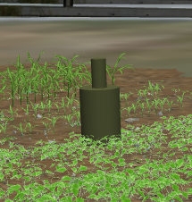

# Challenge 2: Detect the obstacles
The aim of this challenge is to detect obstacles along a trajectory following by the robot.
The trajectory is provided by the organisation team and followed at the speed of 1 m/s.
For the evaluation a different trajectory with different obstacles positions will be given. For the training different trajectories will be provided and the explanation of the method to create your own will be proposed
We evaluate the obstacle detection regarding differents criteria.

## Obstacle to detect
For the remote and fira stages, two different obstacles will be proposed to increase the difficulty and the realism of the simulation.

### Remote stage
Concerning the remote stage, the obstacle to be detected will comply with ISO 18497 standards.

This obstacle can be hide in vineyards or in crops as shown previously.
The obstacle from standard are integrated in the gazebo environment.

### Fira stage

Concerning the FIRA stage, the obstacles will be from different types. The obstacle defined by the ISO 18497 standard will remain, and humans will be included among the obstacles to be detected.

## Provided world and path
In this challenge, the gazebo's world and the robot's path are interdependent. Therefore, selecting the correct path within the appropriate world is crucial.
Hence, understanding the correct variable in the respective configuration file becomes imperative for success.

### Word
To select the environment for testing your solution, access the `simulation.yaml` file and modify the `world_name` variable to match the environment name you want.
You can find the `simulation.yaml` file within the `fira_hackathon_demo/cfg_chal2` repository.

### Path
Regarding the selected environment, you need to choose the right path (or you can do the opposite). For this, add your trajectory file as shown in the doc [challenge1.md](https://github.com/FiraHackathon/fira_hackathon_workspace/blob/devel/doc/challenge1.md) for the format. After adding your trajectory in repository `fira_hackathon_demo/cfg_chal2/paths` and modifying the file `path_matching.yaml` at this location `cfg_chal2/robots/robot/`.

## Evaluation method
For the evaluation of this challenge, the ranking of participants in this challenge will be calculated based on:
* The percentage of successful detection
* The accuracy of the detection (position in GPS coordinates)
* Average time detection regarding an area of 5 meters around the robot
