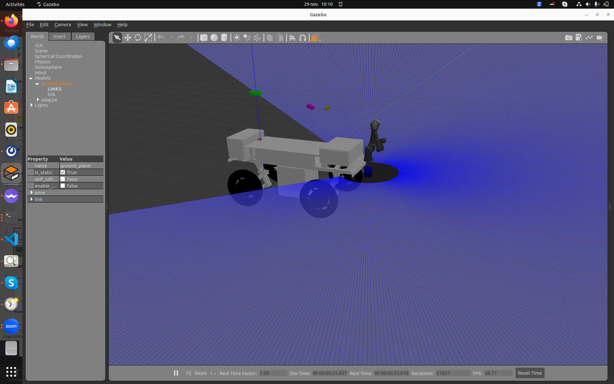

# Challenge 3: Avoid the mobile obstacles
The goal of this challenge is to avoid detecting mobile obstacles along a trajectory followed by the robot. 
The trajectory is provided by the organizing team and is traversed at a speed of 1 m/s.
During evaluation, a distinct trajectory with varied obstacle positions will be provided. For training purposes, different trajectories will be available along with instructions on how to create your own, including the option to modify obstacle positions and trajectories.

The evaluation of obstacle avoidance will be based on various criteria.

## Mobile obstacles

For the remote and fira stages, two different obstacles will be proposed to increase the difficulty and the realism of the simulation.

### Remote stage
During the remote stage, the obstacle will be another robot on the way of yours. This robot will be the following

The robot will be in the crops or vineyard.

### Fira stage
During the FIRA stage, this obstacle will be different and multiple. So in this stage, you will find some robots and walking humans.
As in the remote stage, the obstacle will be in the crops or vineyards to hide them.

## Evaluation method

For this challenge, the evaluation will be on the basis of:
* Number of successful avoidance
* Deviation of the reference trajectory
* Time loss on task