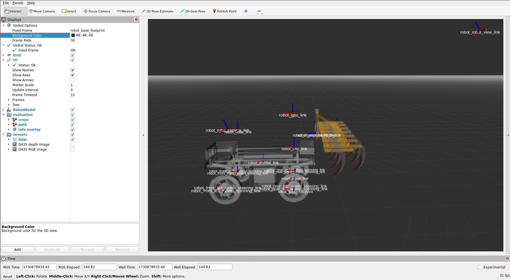

## Robot configuration

#### Base configuration:

For this project, the mobile base selected is the **Adape robot** developed by the **TSCF unit of INRAE**. The `base.yaml` file (see below) defines this configuration choice. This file also allows you to specify the robot’s initial position (`simulation.initial_xyz`) and orientation (`simulation.initial_rpy`) in the simulation environment. By default, these parameters are set to place the robot near the start of the demonstration trajectory.	  

```yaml
name: base # name of the base
configuration:
  type: adap2e  # robot type
  model: fat # robot model
records:
  joint_states: true # joint_states will be recorded into bag
  controller/odom: true # controller/odom will be recorded into bag
  controller/odometry: true  # controller/odometry will be recorded into bag
  controller/kinematic: true # controller/kinematic will be recorded into bag
simulation: 
  initial_xyz: [107.795, 123.508, 1.15] # initial position (meters) of the robot in simulation world
  initial_rpy: [0.014, 0.021, 0.372] # initial oriention (degrees) of the robot in simulation world
```

The mobile base is controlled using `ros2_control`, and several information are published on four topics:

- **`base/joint_states`** (`sensors_msgs/JointState`): Provides joint states (position, velocity, effort) for the robot’s actuators.
- **`base/controller/odom`** (`nav_msgs/Odometry`): Outputs the pose calculated via dead reckoning.
- **`base/controller/odometry`** (`romea_mobile_base_msgs/TwoAxleSteeringMeasure`): Provides displacement measures in the control space (linear speed + front & rear steering angles).
- **`base/controller/kinematic`** (`romea_mobile_base_msgs/KinematicMeasure`): Publishes the twist + instantaneous curvature.

In `base.yaml`, you can specify which topics should be included in the ROS bag during demo recording by setting each item in the `records` section to `true` or `false`.


#### Devices configuration:

The robot can be equipped with various devices (sensors, implements, robotic arms, etc.). The configuration for these onboard devices is split into two parts: the [individual device configurations](devices_configuration.md) (located in the `devices` directory) and the `devices.yaml` file (see below). This file enables you to easily activate or deactivate devices; each item corresponds to a file in the `devices` directory. For each device, specify the device type (`joystick`, `lidar`, `gps`, `imu`, `camera`, `rgbd_camera`, `stereo_camera`, or `implement`) and whether it is available and in which mode (`none`, `simulation`, `live`, or `all`):

- **none**: The device is not supported.
- **simulation**: The device is supported only in simulation mode.
- **live**: The device is supported only in live mode.
- **all**: The device is supported in both simulation and live modes.

To add a new sensor, create a configuration file in the `devices` directory following the naming convention `device_name.device_type.yaml` and add a corresponding entry in `devices.yaml`.

```yaml
remote_controller:
  type: joystick
  available_mode: all

lms151:
  type: lidar
  available_mode: none
ouster:
  type: lidar
  available_mode: all
septentrio:
  type: gps
  available_mode: all
xsens:
  type: imu
  available_mode: all
realsense:
  type: rgbd_camera
  available_mode: all

cultivator:
  type: implement
  available_mode: all
```

You can visualize the position of the devices embedded on the robot using the Rviz visualization software. To do so, simply launch the Rviz Docker service with the following command:

```bash
docker compose run rviz
```

This command starts both the simulator and the Rviz software. In Rviz, open the left panel, set the background color to black, expand the **TF** item, and select **show_names** to display the names of the robot's "mechanical" links. These links, represented by red, blue, and green markers, follow the naming convention `robot_device_name_link`. Their positions are specified in each device's individual configuration file, enabling you to adjust device placement on the robot as desired.



Finally, you can visualize data from the sensors by selecting items in the **sensors** list on the left panel. 

#### Teleop configuration:

The ADAP2E robot can be controlled using a remote controller via the ROS2 teleop node at `/robot/teleop`. This node is responsible for converting inputs from the remote controller into control messages that are sent to the command multiplexer. The configuration of this teleop node is based on the `teleop.yaml` file (see below). This file allows you to specify the type of messages sent to the command multiplexer along with their priority (set to 100 here). Additionally, it defines the maximum allowable command values based on the selected mode: in slow mode, the maximum speed is 2 m/s, and in turbo mode, it is 5 m/s. Since the limits for the rear and front steering angles are unspecified, they are inferred based on the robot's mechanical capabilities.

```yaml
cmd_output:
  message_type: romea_mobile_base_msgs/TwoAxleSteeringCommand # command type
  message_priority: 100  # priority between [0-255]
cmd_range:
  maximal_linear_speed:
    slow_mode: 2.0 # m/s
    turbo_mode: 5.0 # m/s
  #maximal_front_steering_angle: # radian 
  #maximal_rear_steering_angle:  # radian
```

The specific mapping of buttons and sticks on the remote controller is shown in the figure below, detailing how each control input corresponds to different actions on the robot.


#### Localization configuration:

The INRAE TSCF unit provides competitors with a localization algorithm based on a Kalman filter that fuses data from the robot's odometry, the Xsens inertial measurement unit (IMU), and the Septentrio GPS receiver. Four ROS2 nodes are launched to achieve this: a core node, `/robot/localisation/localisation_robot_to_world`, which performs data fusion, and three plugin nodes (`/robot/localisation/odo_plugin`, `/robot/localisation/gps_plugin`, and `/robot/localisation/imu_plugin`) that handle sensor data preprocessing (see pipeline below). These nodes can be configured via the `localisation.yaml` file (example configuration shown below). The filter outputs a ROS2 `nav_msgs/odom` message called `/robot/localisation/filtered_odom`.

```yaml
core:
  pkg: romea_robot_to_world_localisation_core
  launch: robot_to_world_localisation.launch.py
  # configuration:
  #   maximal_dead_recknoning_travelled_distance: 2. # maximal distance in dead reckoning before to reset filter
  #   maximal_dead_recknoning_elapsed_time: 10.  # maximal duration in dead reckoning before to reset filter
  #   publish_rate: 10 # The rate of publishing the filter results (Hz)
  #   debug: true  # Enable debug logs
plugins:
  odo:
    pkg: romea_localisation_odo_plugin
    launch: odo_plugin.launch.py
    # configuration:
    #   controller_topic: kinematic
    #   restamping: false
  imu:
    pkg: romea_localisation_imu_plugin
    launch: imu_plugin.launch.py
    input_sensor_meta_description_filename: xsens
    # configuration:
    #   restamping: false
  gps:
    pkg: romea_localisation_gps_plugin
    launch: gps_plugin.launch.py
    input_sensor_meta_description_filename: septentrio
    # configuration:
    #   restamping: false
    #   minimal_fix_quality: 4  # Minimal fix quality to take into account gps fix into fusion
    #   minimal_speed_over_ground: 0.5 # Minimal speed to take into account gps heading into fusion
```


#### Path following configuration:

The INRAE TSCF unit provides a path following algorithm for participants. This algorithm uses both a reference trajectory and localization data to control the robot. Two ROS 2 nodes are launched to enable this process: the `/robot/path_following/path_matching` node calculates deviations from the trajectory, while the `/robot/path_following/path_following` node computes the commands to send to the robot through the command multiplexer. The path following configuration is specified in the `path_following.yaml` file.

This configuration file allows you to select the control law for computing commands—either the classic [1] or predictive [2] control laws. It also specifies the type of messages sent to the command multiplexer along with their priority (set to 10). This priority is lower than that of teleoperation, meaning that path following messages will be ignored if the robot is controlled via the remote controller. Finally, the file allows you to specify whether path following should start automatically or not.

```yaml
sampling_period: 10.0 

# configuration of longitudinal control
longitudinal_control:
  minimal_linear_speed: 0.3 # minimal speed during maneuvers

# configuration for classic and predictive lateral control laws
lateral_control:
  selected: classic  # selected control law see below
  classic:
    gains:
      front_kd: 0.7 
      rear_kd: 0.5
  predictive:
    gains:
      front_kd: 0.7
      rear_kd: 0.4
    prediction:
      horizon: 10
      a0: 0.1642
      a1: 0.1072
      b1: 1.0086
      b2: -0.2801

# control setpoint
setpoint: 
  desired_linear_speed: 2.0
  desired_lateral_deviation: 0.0
  desired_course_deviation: 0.0

#configuration for cmd_mux auto connection
cmd_output:
  message_type: romea_mobile_base_msgs/TwoAxleSteeringCommand # type of message send to robot
  priority: 10 # priority of these message between [0-255], must be lower than teleop 
  rate: 10. # Rate (Hz) at which these messages are published

autostart: false # autostart path following if path matching is OK
debug: true # enable debug logs
```

If `autostart` is not selected, path following needs to be started manually using the remote controller. The image below shows the controller mapping: the X button starts path following, and the B button stops it. Note that even if path following starts automatically, manual control can always be taken via the remote controller


.
